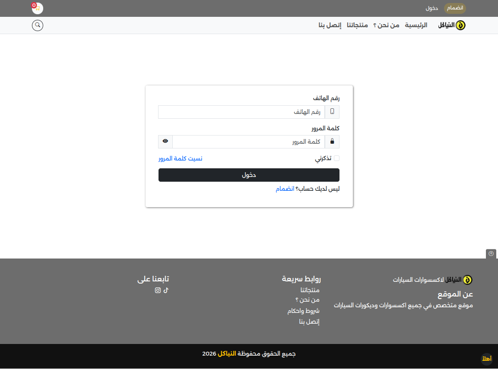
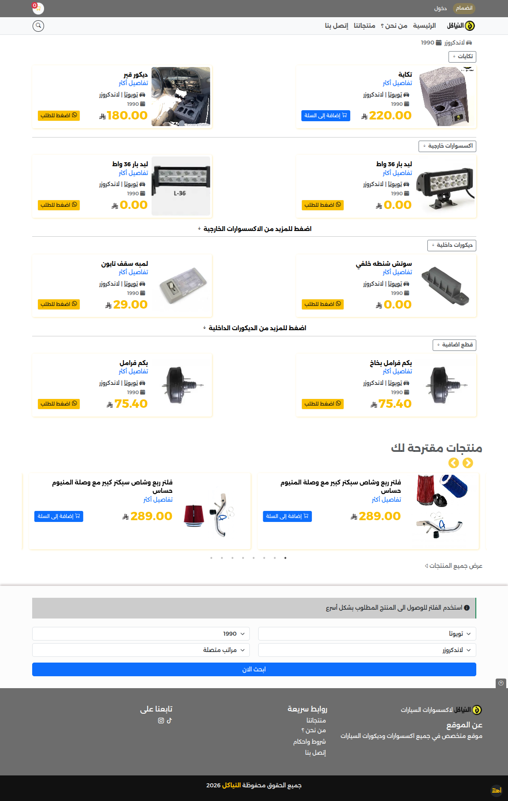
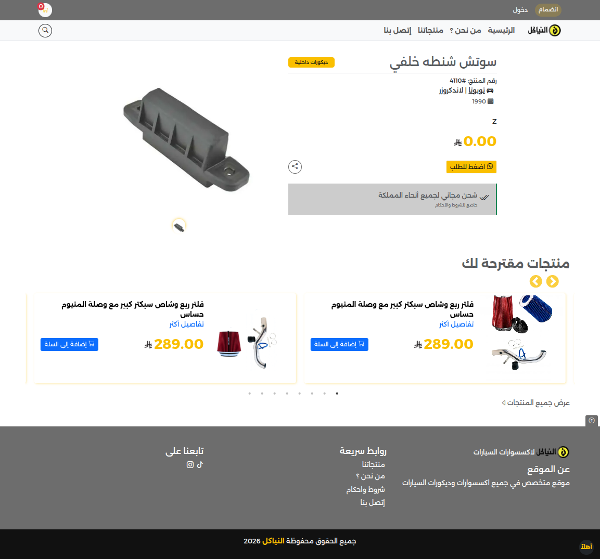
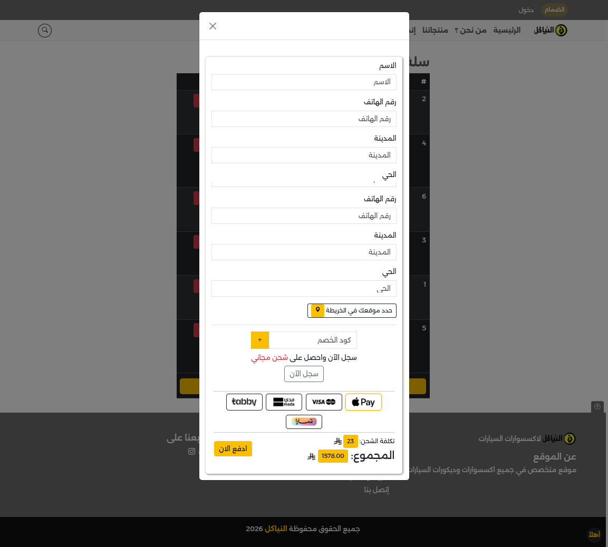

# Al Niakel — Enterprise Commerce & ERP Ecosystem

**A high-precision, multi-tier operational platform engineered for the automotive aftermarket industry.**

[](https://alniakel.com/)

It is a **comprehensive ERP-Lite solution** designed to orchestrate complex supply chain logistics, financial auditing, and multi-branch inventory management. It enforces strict business logic for profitability, tax compliance, and role-based operational security.

---

## 🏛 System Architecture & Core Modules

### 1. Advanced Inventory Control (WMS)
*   **Real-Time Stock Reconciliation**:
    *   **Live Deduction**: Stock is reserved immediately upon order creation and deducted permanently upon payment capture.
    *   **"SND" Stocktaking Protocol**:
        *   Dedicated auditor interface to input *Physical Count* vs. *System Count*.
        *   Automated Variance Calculation: `(Physical - System) * Purchase Price = Deficit/Surplus Value`.
        *   Generates a financial liability report for the warehouse manager.
*   **Procurement Cycle**:
    *   **Purchasing Officer**: Manages supplier orders, "Partial Delivery" tracking, and "Stock Replenishment" upon arrival.
    *   **Warehouse Manager**: Validates incoming goods before they enter the active sales inventory.
*   **"Takayat" Specialized Module (Category 2)**:
    *   **Grouped Video Logic**: Products sharing a `group_key` automatically inherit the same installation video.
    *   **Bulk Defaults**: Auto-assigns a default purchase cost (e.g., 100 SAR) if unspecified during creation.
    *   **Add-to-Cart Customization**: Specialized UI flow for "Takayat" items with "Add to Cart" directly from the listing grid.

### 2. Financial Intelligence & Profitability Engine
The system employs a rigorous financial model to calculate **True Net Profit** per transaction, accounting for all hidden costs.

#### 💰 Exact Profit Formula
```math
Net Profit = (Selling Price - VAT) - (Purchase Price + Purchase Tax) - Shipping Cost - Gateway Fee
```

#### 💳 Payment Gateway Integration (Surcharge & Fees)
*   **Dynamic Surcharging**:
    *   **Tamara**: Automatically adds a configurable % (e.g., 5%) to the cart total to cover installment fees.
    *   **Tabby**: Configurable surcharge support.
    *   **Tap (Mada/Visa/Apple Pay)**: Standard processing fee deduction from reports.
*   **Webhooks**: Robust `CAPTURED` and `APPROVED` status handling for all gateways to ensure order status synchronization.

#### 🧾 Taxation & Compliance
*   **Global VAT**: 15% (Configurable) applied to all sales.
*   **Inclusive/Exclusive Pricing**: Toggles to display "Price Includes Tax" or calculate it on top.
*   **Purchase Tax**: Automatically adds 15% to the *Cost Price* when calculating inventory valuation.

### 3. Multi-Branch & Marketer Network
*   **Branch Operations**:
    *   **Internal Inventory Requests**: Branch Managers request stock from the Main Warehouse.
    *   **Workflow**: `Request` -> `Storekeeper Approval` -> `Dispatch` -> `Branch Receipt`.
    *   **Branch Sales**: POS-like interface for in-branch sales tracking.
*   **Marketer Affiliate System**:
    *   **Commission Models**: Supports both **Percentage (%)** and **Fixed Amount (SAR)** commissions.
    *   **Discount Codes**: unique trackable codes for influencers.
    *   **Performance Dashboard**: Real-time view of used codes, total sales volume, and due commissions.

---

## 🛡 Role-Based Access Control (RBAC) Matrices

The system is secured by granular middleware policies ensuring strict separation of duties:

| Role | Responsibility Scope | Key Permissions |
| :--- | :--- | :--- |
| **Admin** | **System Sovereign** | Full access to logs, settings, financial reports, and user management. |
| **Product Manager** | **Catalog Operations** | Create/Edit products, Manage attributes (Brand/Model/Year), Upload Media. *Cannot delete products without special auth.* |
| **Warehouse Manager** | **Stock Guardian** | Approve dispatch requests, Perform SND stocktaking, Reject invalid returns. |
| **Purchasing Officer** | **Supply Chain** | Create supplier purchase orders (PO), Update "Sold Out" status, Receive goods. |
| **Branch Manager** | **Local Retail** | Request inventory, Manage branch-specific sales, View local stock levels. |
| **Shipping Rep** | **Logistics** | Update delivery status (`Out for Delivery`, `Delivered`), Upload **Waybill/POD** (Image/PDF). |
| **Marketer** | **Affiliate Sales** | View personal dashboard, Track commission earnings, Monitor code usage. |

---

## 🛠 Technical Specifications & Optimizations

*   **Backend Core**: Laravel 11 (PHP 8.2+) with strict typing.
*   **Frontend**: Native Bootstrap 5.
*   **Performance Pipeline**:
    *   **Auto-WebP**: Background service converts ALL uploaded product images to WebP format, reducing payload by ~60%.
    *   **SQL Optimization**: Heavy reports use optimized `SUM()` and `GROUP BY` aggregates to handle thousands of orders in milliseconds.
*   **SEO Automation**:
    *   Dynamic `sitemap.xml` generation for all products and categories.
    *   Meta-tag automation based on Product Name + Model/Year compatibility.
*   **Geospatial**: Google Maps integration for capturing customer delivery coordinates (Lat/Long) accurately.

---

## 📊 Reporting Suite (Executive Grade)

All reports are exportable to **Excel** & **PDF** with cryptographic financial accuracy.

1.  **Sales & Profit Report**:
    *   Columns: `Order ID`, `Date`, `Subtotal`, `Tax`, `Shipping Cost`, `Gateway Fee`, `Net Profit`.
    *   Filters: Date Range, Payment Method (Tap/Tamara), Category.
2.  **Inventory Valuation**:
    *   calculates total asset value based on *Weighted Average Cost*.
3.  **Marketer Settlement**:
    *   Generates payout statements for affiliates based on confirmed (paid) orders only.
4.  **Operational Logs**:
    *   Immutable audit trail of *who* changed *what* (e.g., "User X changed price of Product Y from 100 to 120").

---

## 📸 System Gallery
 

---
 

---
 

---
 

---
 
